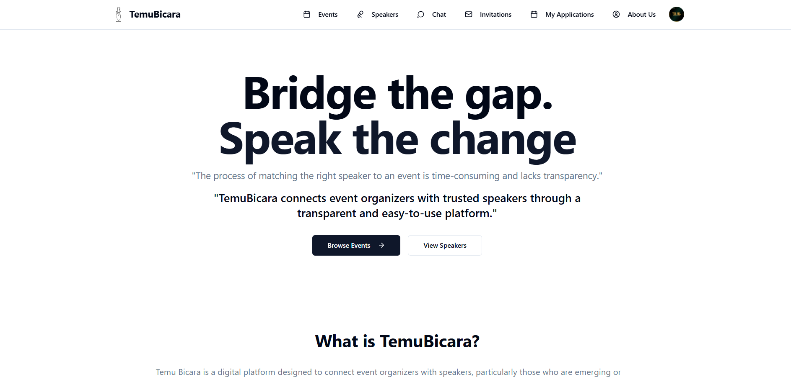
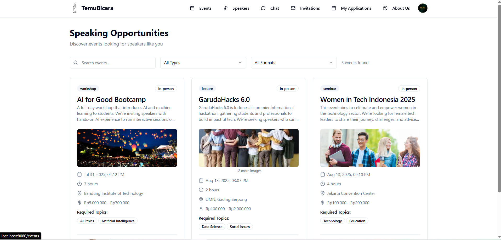
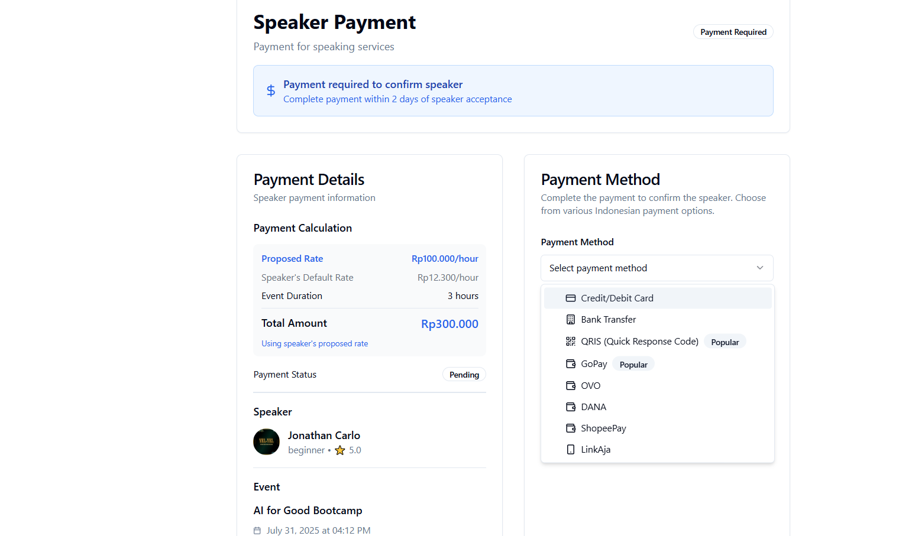
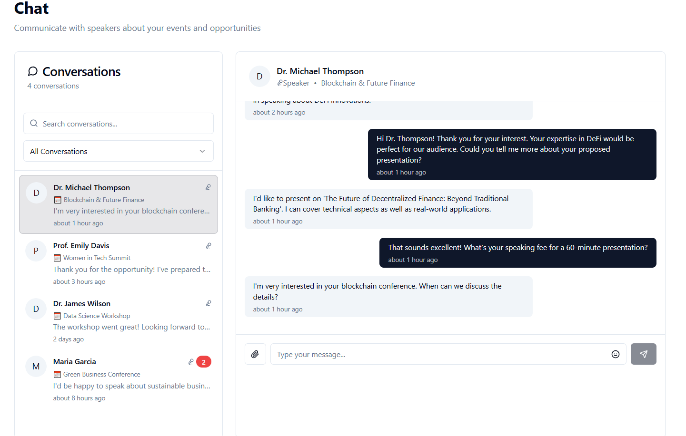

# Temu Bicara – Connect. Speak. Empower.

A platform that connects speakers with event organizers while providing a secure and transparent payment system to empower lesser-known voices.


## Table of Contents

- [About the Project](#about-the-project)
- [Features](#features)
- [Screenshots / Demo](#screenshots--demo)
- [Tech Stack](#tech-stack)
- [Getting Started](#getting-started)
- [Folder Structure](#folder-structure)
- [Environment Variables](#environment-variables)
- [API Reference](#api-reference)
- [Roadmap / Future Plans](#roadmap--future-plans)
- [Contributing](#contributing)
- [License](#license)
- [Contact](#contact)

## About the Project

Temu Bicara is a comprehensive speaker-organizer matchmaking and event management platform that also serves as a secure payment bridge. The platform empowers new and lesser-known speakers by giving them access to professional opportunities, and helps organizers find suitable, trustworthy, and verified speakers with ease.

### The Problem

_"The process of matching the right speaker to an event is time-consuming and lacks transparency."_

### Our Solution

_"TemuBicara connects event organizers with trusted speakers through a transparent and easy-to-use platform."_

Whether it's for seminars, conferences, lectures, or workshops—Temu Bicara empowers new voices, helps organizers find relevant speakers efficiently, and fosters a more inclusive knowledge-sharing ecosystem.

## Features

### 🎯 Core Features

- **👥 AI-Based Speaker & Organizer Matching** - Smart tag-based matching by topic, budget, and location
- **💼 Secure Booking & Payment System** - Escrow system with auto disbursement and digital contracts
- **📈 Speaker Growth Tools** - Comprehensive profiles, analytics dashboard, and feedback system
- **📅 Event Management** - Event creation, invitation management, and auto documentation
- **📩 Communication & Scheduling** - Built-in chat, video calls, and smart notifications
- **🛡️ Trust & Safety** - ID/KTP verification, RLS scoring, and transparent reviews

### 🚀 Advanced Features

- **Multi-Payment Support** - E-wallets (GoPay, OVO, DANA, ShopeePay, LinkAja), QRIS, Bank Transfer
- **Role-Based Dashboards** - Unified interface for both speakers and organizers
- **Real-time Chat System** - Professional communication between speakers and organizers
- **Application Tracking** - Complete speaker invitation and application management
- **Event Completion System** - Post-event ratings and feedback collection
- **Mobile-Responsive Design** - Optimized for all device types

## Screenshots / Demo

### Homepage - Key Features Overview


_Comprehensive feature showcase with horizontal card layout_

### Speaker Discovery & Profiles


_Detailed speaker profiles with portfolios, ratings, and expertise_

### Event Management Dashboard


_Complete event lifecycle management for organizers_

### Payment System


_Indonesian-focused payment methods with comprehensive options_

### Chat & Communication


_Professional communication platform for speakers and organizers_

[👉 Live Demo](https://garudahacks-orcin.vercel.app/)

## Tech Stack

**Frontend:**

- React 18 with TypeScript
- Vite for build tooling
- TailwindCSS for styling
- Shadcn/ui for component library
- React Router for navigation
- React Query for state management

**Backend:**

- Supabase for backend services
- PostgreSQL database
- Row Level Security (RLS)
- Real-time subscriptions

**Authentication & Security:**

- Supabase Auth
- Profile-based user management
- Role-based access control

**Payment Integration:**

- Multiple Indonesian payment methods
- Escrow system ready
- QRIS and e-wallet support

**Additional Tools:**

- Lucide React for icons
- Date-fns for date formatting
- React Hook Form for form management
- Zod for validation

## Getting Started

### Prerequisites

- Node.js 18+
- npm or yarn
- Supabase account

### Installation

1. **Clone the repository**

   ```bash
   git clone https://github.com/Exilitys/Garudahacks.git
   cd Garudahacks
   ```

2. **Install dependencies**

   ```bash
   npm install
   # or
   yarn install
   ```

3. **Set up environment variables**

   ```bash
   cp .env.example .env.local
   ```

   Fill in your Supabase credentials and other required variables.

4. **Set up Supabase database**

   ```bash
   # Initialize Supabase (if not already done)
   npx supabase init

   # Run migrations
   npx supabase db reset
   ```

5. **Start the development server**

   ```bash
   npm run dev
   # or
   yarn dev
   ```

6. **Open your browser**
   Navigate to `http://localhost:5173`

## Folder Structure

```
/src
 ┣ /components          # Reusable UI components
 ┃ ┣ /ui               # Shadcn/ui components
 ┃ ┗ ...               # Custom components
 ┣ /pages              # Page components
 ┃ ┣ Auth.tsx          # Authentication page
 ┃ ┣ HomePage.tsx      # Landing page
 ┃ ┣ Events.tsx        # Event listing
 ┃ ┣ EventDetail.tsx   # Event details
 ┃ ┣ Speakers.tsx      # Speaker directory
 ┃ ┣ Chat.tsx          # Communication system
 ┃ ┣ PaymentPage.tsx   # Payment processing
 ┃ ┗ ...               # Other pages
 ┣ /contexts           # React contexts
 ┃ ┗ AuthContext.tsx   # Authentication context
 ┣ /hooks              # Custom React hooks
 ┣ /integrations       # External service integrations
 ┃ ┗ /supabase         # Supabase configuration
 ┣ /lib                # Utility functions
 ┗ /styles             # Global styles
/supabase
 ┣ /migrations         # Database migrations
 ┗ config.toml         # Supabase configuration
/dataset               # Sample data and assets
/public                # Static assets
```

## Environment Variables

Create a `.env.local` file in the root directory:

```env
# Supabase Configuration
VITE_SUPABASE_URL=your_supabase_project_url
VITE_SUPABASE_ANON_KEY=your_supabase_anon_key

# Optional: Additional configurations
VITE_APP_NAME=Temu Bicara
VITE_APP_URL=http://localhost:5173

# Payment Gateway (Future)
VITE_MIDTRANS_CLIENT_KEY=your_midtrans_client_key
VITE_XENDIT_PUBLIC_KEY=your_xendit_public_key
```

## API Reference

### Core Endpoints (Supabase)

**Profiles**

- `GET /profiles` - Get user profiles
- `POST /profiles` - Create user profile
- `PATCH /profiles/{id}` - Update profile

**Events**

- `GET /events` - List all events
- `GET /events/{id}` - Get event details
- `POST /events` - Create new event
- `PATCH /events/{id}` - Update event

**Speakers**

- `GET /speakers` - List all speakers
- `GET /speakers/{id}` - Get speaker profile
- `POST /speakers` - Register as speaker

**Bookings**

- `GET /bookings` - Get user bookings
- `POST /bookings` - Create booking/application
- `PATCH /bookings/{id}` - Update booking status

**Speaker Invitations**

- `GET /speaker_invitations` - Get invitations
- `POST /speaker_invitations` - Send invitation
- `PATCH /speaker_invitations/{id}` - Respond to invitation

### Database Schema

Key tables include:

- `profiles` - User profiles and authentication
- `speakers` - Speaker-specific information
- `events` - Event details and management
- `bookings` - Applications and confirmed bookings
- `speaker_invitations` - Direct speaker invitations
- `speaker_ratings` - Post-event feedback system

## Roadmap / Future Plans

### ✅ Completed (MVP)

- [x] User authentication and profiles
- [x] Speaker directory and profiles
- [x] Event creation and management
- [x] Speaker application system
- [x] Payment interface (UI ready)
- [x] Chat system for communication
- [x] Role-based dashboards
- [x] Event completion and ratings

### 🚧 In Progress

- [ ] Real-time payment processing integration
- [ ] Mobile app optimization
- [ ] Advanced search and filtering
- [ ] Notification system enhancement

### 🎯 Future Enhancements

- [ ] AI-powered speaker recommendations
- [ ] Calendar integration (Google Calendar, Outlook)
- [ ] Video conferencing integration
- [ ] Advanced analytics and reporting
- [ ] Mobile app (React Native)
- [ ] Multi-language support (Bahasa Indonesia)
- [ ] Speaker verification system
- [ ] Event livestreaming integration
- [ ] Contract generation automation
- [ ] Tax and invoice management

## Contributing

We welcome contributions from the community! Here's how you can help:

### How to Contribute

1. **Fork the repository**
2. **Create a feature branch**
   ```bash
   git checkout -b feature/amazing-feature
   ```
3. **Make your changes**
4. **Commit your changes**
   ```bash
   git commit -m 'Add some amazing feature'
   ```
5. **Push to the branch**
   ```bash
   git push origin feature/amazing-feature
   ```
6. **Open a Pull Request**

### Development Guidelines

- Follow TypeScript best practices
- Use existing component patterns
- Write meaningful commit messages
- Test your changes thoroughly
- Update documentation as needed

### Areas for Contribution

- UI/UX improvements
- Payment gateway integrations
- Mobile responsiveness
- Performance optimizations
- Documentation improvements
- Bug fixes and testing

## License

This project is licensed under the MIT License - see the [LICENSE](LICENSE) file for details.

## Contact

**Project Maintainers:**

👨‍💻 **Jonathan Carlo** - Lead Developer & Founder

- University: Bina Nusantara University (Computer Science)
- LinkedIn: [Jonathan Carlo](https://www.linkedin.com/in/jonathan-carlo-670b73233/)
- Email: jonathancarlo20@gmail.com

👨‍💻 **Christopher Bryan** - Full-Stack Developer & Co-Founder

- University: Bina Nusantara University (Computer Science)
- LinkedIn: [Christopher Bryan](https://linkedin.com/in/christopher-bryan)
- Email: christopher.bryansh@gmail.com

👨‍💻 **Julian Sudiyanto** - Full Stack Developer & Co-Founder

- University: Telkom University (Data Science)
- LinkedIn: [Julian Sudiyanto](https://www.linkedin.com/in/julian-sudianto-536a1430b/)
- Email: juliansudianto0504@gmail.com

---

## Acknowledgments

- Built for **Garuda Hacks 2025**
- Special thanks to the open-source community
- Inspired by the need for inclusive speaker platforms
- Icons by [Lucide](https://lucide.dev/)
- UI Components by [shadcn/ui](https://ui.shadcn.com/)

---

<div align="center">

**🎤 Empowering voices, connecting opportunities 🎤**

Made with ❤️ in Indonesia for [GARUDAHACKS6.0](https://garudahacks.com/)

[⬆ Back to Top](#temu-bicara--connect-speak-empower)

</div>
